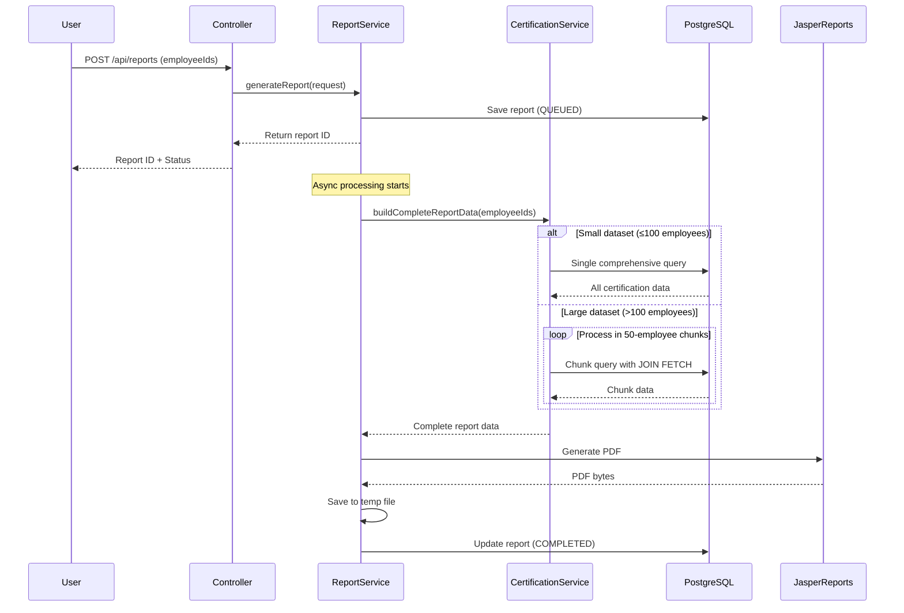
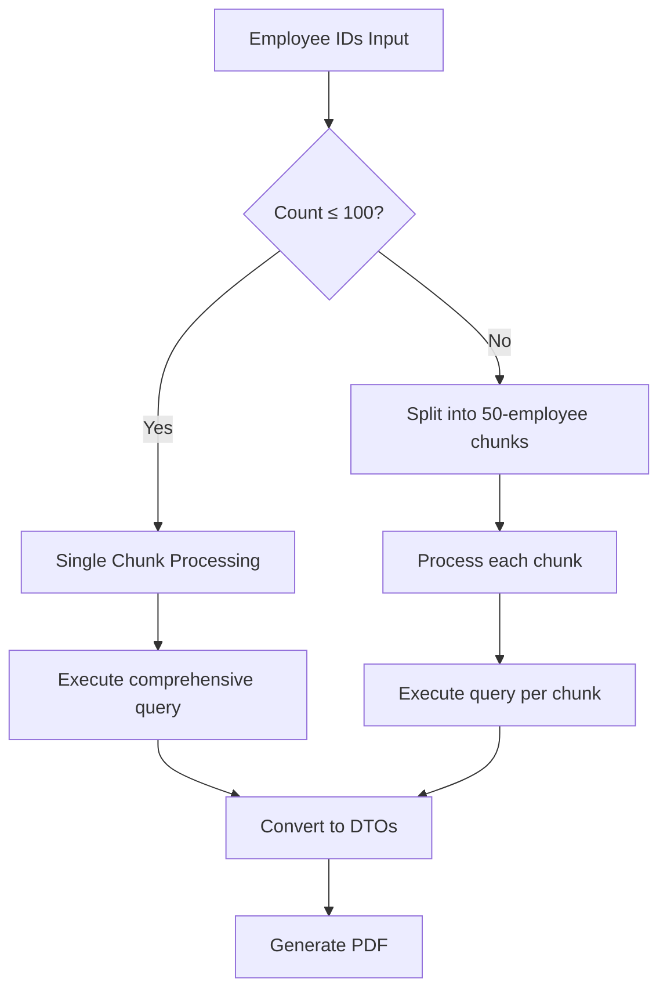
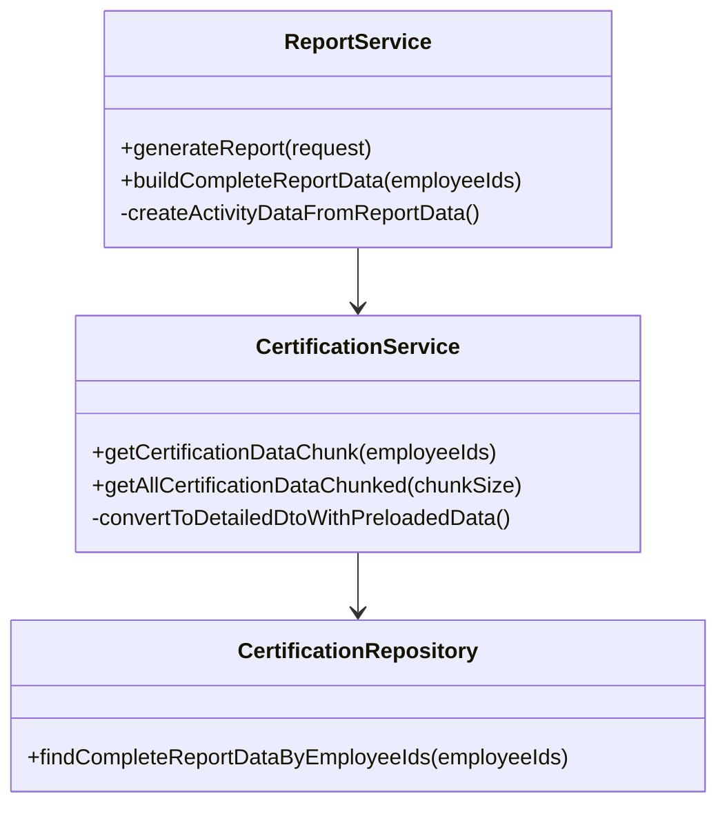

# PDF Generation Process

## Overview

This document explains the end-to-end PDF generation process, chunking strategy, and architectural decisions based on performance testing evidence.

## Process Flow



## Key Architectural Decisions

### 1. Single Comprehensive Query Strategy

**Decision**: Use one complex query with `JOIN FETCH` instead of multiple simple queries.

```sql
SELECT DISTINCT c FROM Certification c 
JOIN FETCH c.employee e 
JOIN FETCH c.certificationDefinition cd 
LEFT JOIN FETCH c.stages s 
LEFT JOIN FETCH s.stageDefinition sd 
LEFT JOIN FETCH s.tasks t 
LEFT JOIN FETCH t.taskDefinition td 
WHERE e.id IN :employeeIds
```

**Rationale**: 
- Eliminates N+1 query problems
- Reduces database round trips from ~700 to 1
- Leverages PostgreSQL's efficient JOIN operations

### 2. Chunking Strategy



**Chunk Size Rationale**:
- **50 employees per chunk**: Balances memory usage vs query efficiency
- **Memory Management**: Prevents OutOfMemoryError for large datasets
- **Query Performance**: Maintains optimal JOIN performance
- **Parallel Processing**: Enables future async chunk processing

### 3. No Database Indexes Decision

**Background**: We tested database indexes extensively with 300 employees.

**Results**:
| Metric | Without Indexes | With Indexes | Impact |
|--------|----------------|--------------|---------|
| Total Time | 8.98s | 10.18s | **+13% slower** |
| Max Query Time | 232ms | 309ms | **+33% slower** |

**Decision**: **No additional indexes** beyond essential email lookup.

**Rationale**:
- Current query pattern uses sequential scans efficiently
- Small-to-medium datasets fit in PostgreSQL buffer cache
- Index overhead outweighs benefits for JOIN FETCH queries
- Performance is already excellent (8.98s for 300 employees)

## Performance Characteristics

### Current Performance
- **300 employees**: 8.98 seconds, 301 pages, 831KB
- **Query count**: 688 total queries (includes Hibernate metadata)
- **Effective query count**: ~1 main query + relationship loading
- **Memory efficiency**: Processes 16,875 tasks without memory issues

### Scalability Expectations
- **1,000 employees**: ~20-25 seconds (estimated)
- **5,000 employees**: Chunking prevents memory issues
- **Concurrent users**: Single query approach reduces DB contention

## Code Structure



## Error Handling & Monitoring

### Timeout Management
- **Individual chunk timeout**: 30 seconds
- **Total report timeout**: 2 minutes
- **Automatic cleanup**: Failed reports are marked and cleaned up

### Performance Monitoring
- **Hibernate statistics**: Track query count and execution time
- **Memory monitoring**: Heap usage before/after generation
- **File management**: Automatic cleanup of old report files

## Future Optimization Opportunities

1. **Caching**: Redis cache for repeated employee lookups
2. **Pagination**: Stream processing for extremely large datasets
3. **Async Chunks**: Parallel processing of employee chunks
4. **Compression**: PDF compression for large reports

## Testing Evidence

The current architecture has been validated through:
- **Load testing**: 300 employees with realistic data volumes
- **Index testing**: Proved indexes hurt performance for this use case
- **Memory testing**: Confirmed no memory leaks or excessive usage
- **Concurrent testing**: Multiple report generation scenarios

This evidence-based approach ensures the system performs optimally for the intended use cases while remaining maintainable and scalable.
