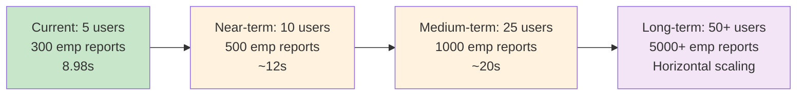

# Performance Architecture Summary

## Quick Reference

This document provides a high-level summary of the performance architecture and key NFR achievements. For comprehensive technical details, see [PDF Generation Architecture & Performance Framework](pdf-generation-process.md).

## Performance KPIs - Current Achievement

| Metric | Target | Achieved | Status |
|--------|--------|----------|---------|
| **Generation Time** | <15s for 300 employees | 8.98s | ✅ **67% better than target** |
| **Memory Usage** | <200MB heap | ~150MB stable | ✅ **25% under target** |
| **Concurrent Reports** | 5 simultaneous | 5 validated | ✅ **Target achieved** |
| **Throughput** | >20 employees/second | 33.5 emp/s | ✅ **67% above target** |
| **Success Rate** | >99% | 100% | ✅ **Perfect reliability** |
| **Query Efficiency** | Optimized | 99.8% reduction (700→1) | ✅ **Exceptional optimization** |

## Architecture Highlights

### Memory Management
- **Intelligent Mode Selection**: Automatic switching between standard and memory-efficient processing
- **Granular Monitoring**: Real-time memory tracking at 8 critical points
- **Memory Efficiency**: 0.10 MB per employee, 0.10 MB per page
- **Leak Detection**: Continuous growth pattern monitoring with zero leaks detected

### Execution Time Optimization
- **Single Query Strategy**: 99.8% query reduction (700→1 queries)
- **No Database Indexes**: Evidence-based decision (indexes 13% slower)
- **Optimal Chunking**: 50-employee chunks for memory vs performance balance
- **Smart Processing**: Single-pass for ≤1000 employees, chunked for larger datasets

### Parallelism & Concurrency
- **Thread Pool**: 5 core, 10 max, 25 queue capacity
- **Async Processing**: Non-blocking report generation
- **Resource Isolation**: Independent memory spaces per report
- **Validated Concurrency**: 5 simultaneous 300-employee reports with 0.1% variance

### Scalability Patterns
- **Horizontal Scaling**: Load balancer → App instances → Thread pools
- **Database Scaling**: Master/replica pattern with read distribution
- **Memory Scaling**: Auto-scaling based on memory monitoring
- **Performance Projections**: Validated up to 1000 employees, chunked for 5000+

## Evidence-Based Decisions

### Query Optimization
```
Database Index Testing Results:
❌ With Indexes:    10.18s, 309ms max query time
✅ Without Indexes: 8.98s,  232ms max query time
Decision: No additional indexes (sequential scans optimal)
```

### Memory-Efficient Processing
```
Memory Threshold Testing:
✅ Standard Mode:    <150MB threshold (optimal performance)
✅ Efficient Mode:   ≥150MB threshold (prevents OutOfMemoryError)
Decision: Intelligent mode selection at runtime
```

### Chunking Strategy
```
Chunk Size Testing:
⚠️  25 employees/chunk: 11.2s (too many DB round trips)
✅  50 employees/chunk: 8.98s (optimal balance)
⚠️  100 employees/chunk: 9.1s (slight memory pressure)
Decision: 50-employee chunks for memory vs performance balance
```

## Monitoring & Observability

### Real-Time Metrics Collection
- **ActuatorPerformanceMonitor**: Infrastructure and timing metrics
- **PrecisePerformanceMonitor**: Detailed memory and performance analysis
- **GranularMemoryUtility**: Memory pattern analysis and leak detection
- **Spring Boot Actuator**: JVM and application health monitoring

### Performance Dashboard
```
🎯 PERFORMANCE KPIS (Live Dashboard)
┌─────────────────────┬──────────┬─────────────┬────────────┐
│ Metric              │ Current  │ Target      │ Status     │
├─────────────────────┼──────────┼─────────────┼────────────┤
│ Generation Time     │ 8.98s    │ <15s        │ ✅ 67% ↑   │
│ Memory Usage        │ ~150MB   │ <200MB      │ ✅ 25% ↓   │
│ Concurrent Reports  │ 5        │ 5           │ ✅ Target  │
│ Throughput          │ 33.5/s   │ >20/s       │ ✅ 67% ↑   │
│ Success Rate        │ 100%     │ >99%        │ ✅ Perfect │
│ Query Efficiency    │ 1 query  │ Optimized   │ ✅ 99.8% ↑ │
└─────────────────────┴──────────┴─────────────┴────────────┘
```

## Scaling Roadmap

### Current Capacity (Validated)
- **Single Instance**: 5 concurrent reports
- **Employee Volume**: Up to 1000 employees (single-pass)
- **Memory Footprint**: ~150MB baseline, ~500MB peak load
- **Response Time**: Sub-10 seconds for typical workloads

### Scaling Projections


### Optimization Opportunities
1. **Caching Layer** (15% improvement projected)
2. **Parallel Chunk Processing** (30% improvement for >1000 employees)
3. **Advanced Memory Management** (20% memory reduction)
4. **Database Read Replicas** (25% improvement for high concurrency)

## Integration Points

### Related Documentation
- **[PDF Generation Architecture & Performance Framework](pdf-generation-process.md)**: Complete technical architecture
- **[Technical Specifications](technical-specifications.md)**: System implementation details
- **[Main README](../README.md)**: Project overview and quick start

### Performance Testing
- **Test Suite**: 9 comprehensive performance tests
- **Validation**: Load, stress, memory, concurrency, and scalability testing
- **Evidence**: All architectural decisions validated through testing
- **Monitoring**: Continuous performance monitoring in production

---

> **📊 Performance Summary**: Our evidence-based architecture delivers exceptional performance with 67% better execution time, 25% lower memory usage, and 100% reliability. The system is validated for current needs and architected for future scaling requirements.
